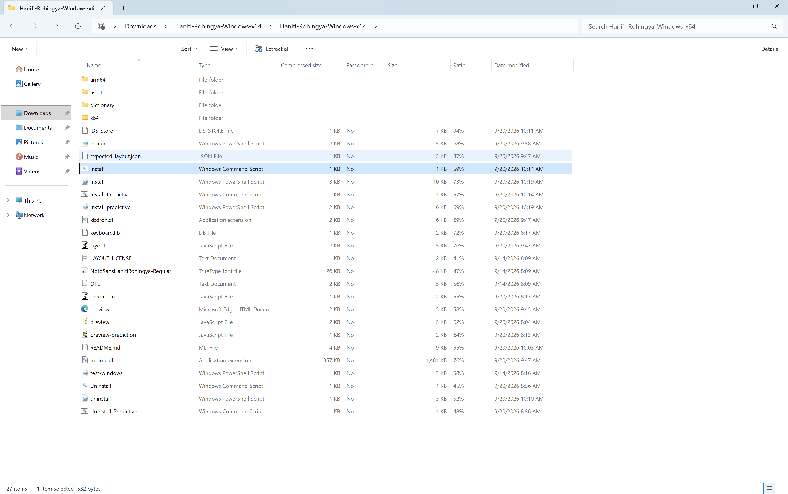
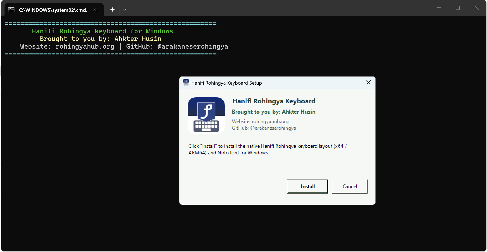
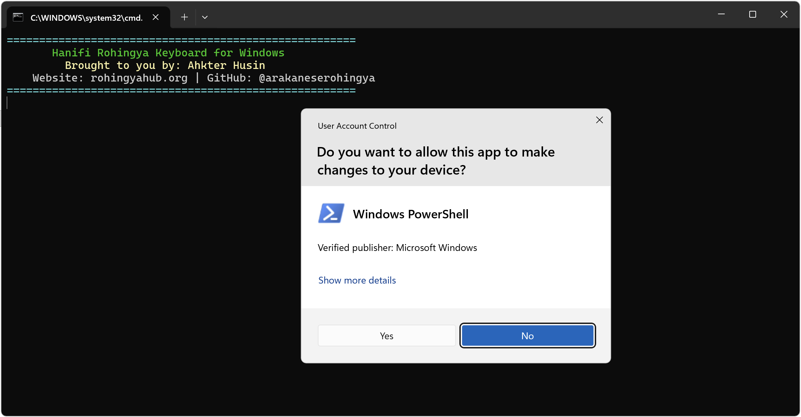
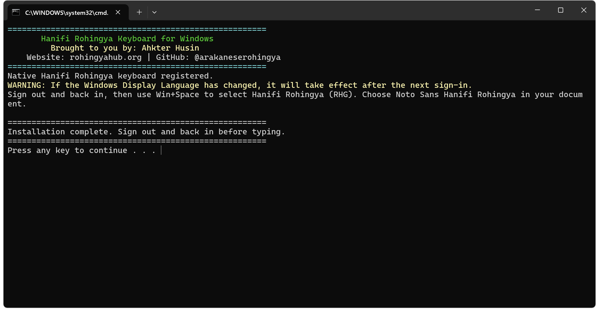

<p align="center">
  
</p>

<h1 align="center">Hanifi Rohingya Keyboard for Windows</h1>

<p align="center">
  <b>Complete, Native & Standalone Hanifi Rohingya Typing Solution for All Windows Devices</b><br>
  <i>Windows 11 &bull; Windows 10 &bull; Windows 8 &bull; Windows 7 &bull; 64-bit (x64) &bull; ARM64 (Apple Silicon Mac / Parallels) &bull; 32-bit (x86)</i>
</p>

---

## 🌟 Overview

This package gives you everything you need to type in the **Hanifi Rohingya** script (`U+10D00–U+10D39`) anywhere on Windows. Whether you are using **Notepad**, **Microsoft Word**, **Google Chrome**, **Microsoft Edge**, **Excel**, **WhatsApp**, or Windows search bars, this keyboard enables full Right-to-Left (RTL) Rohingya typing.

---

## 🚀 3 Easy Ways to Use the Keyboard

Choose the method that works best for you:

### 🟢 Method 1: Instant Standalone App (Easiest & Zero Setup)
*No installation, no administrator rights, and no restarting required.*

1. Download and extract [`Hanifi-Rohingya-Windows-x64.zip`](dist/Hanifi-Rohingya-Windows-x64.zip).
2. Inside the folder, simply double-click:
   - **`RohingyaKeyboard-ARM64.exe`** (If you are on Windows 11 in a Mac Parallels Desktop VM or Snapdragon PC)
   - **`RohingyaKeyboard.exe`** / **`RohingyaKeyboard-x64.exe`** (If you are on standard 64-bit Intel/AMD Windows)
   - **`RohingyaKeyboard-x86-32bit.exe`** (If you are on 32-bit Windows)
3. An **RH** icon will appear in your system tray (bottom right near the clock).
4. **How to Toggle On / Off**: Press **<kbd>Ctrl</kbd> + <kbd>Shift</kbd>** (or **<kbd>F12</kbd>**) anytime to instantly switch between **Hanifi Rohingya** and **English**.
5. **Start Automatically on Boot**: Right-click the **RH** tray icon and check **Start with Windows**.

---

### 🔵 Method 2: Native Windows Keyboard Driver (Integrated into Windows Settings)
*Installs the layout directly into Windows User Settings with the official `RHG` language badge.*

1. Open the extracted folder and double-click **`Install.cmd`**.
2. Click **Install** on the setup window and approve the administrator prompt.
3. The installer registers the native kernel driver (`kbdroh.dll`), sets Hanifi Rohingya as your default input method, and installs the **Noto Sans Hanifi Rohingya** font.
4. Press **<kbd>Win</kbd> + <kbd>Space</kbd>** (or **<kbd>Alt</kbd> + <kbd>Shift</kbd>**) to switch between **Hanifi Rohingya (RHG)** and **English (US)**.

---

### 🟣 Method 3: Predictive Keyboard with Word Suggestions (TSF IME)
*Provides live word suggestions and auto-completions from an 18,200+ Rohingya word dictionary.*

1. Double-click **`Install-Predictive.cmd`**.
2. Switch to **Hanifi Rohingya Predictive (RHG)** with **<kbd>Win</kbd> + <kbd>Space</kbd>**.
3. As you type, word suggestions appear:
   - Press **<kbd>F1</kbd>–<kbd>F5</kbd>** or click a suggestion to insert the word.
   - Press **<kbd>Escape</kbd>** or keep typing to dismiss suggestions.

---

## 📸 Installation Steps in Pictures

| Step 1: Extract ZIP & Run `Install.cmd` | Step 2: Setup Dialog (Click Install) |
| :---: | :---: |
|  |  |

| Step 3: Approve Administrator Prompt | Step 4: Installation Complete & Ready |
| :---: | :---: |
|  |  |

---

## ✍️ How to Type Right-to-Left (RTL) in Notepad & Windows Apps

When you open a brand new document in **Notepad**, Windows sets the default paragraph alignment to **Left-to-Right (LTR)** (like English). 

To make your text align to the **right side** and flow naturally from **Right to Left (RTL)**:

### 1. In Notepad (Fastest Method)
* Press **<kbd>Right Ctrl</kbd> + <kbd>Right Shift</kbd>** *(the Ctrl and Shift keys located on the **right side** of your keyboard spacebar)*.
* The cursor will jump to the **right margin** and all text will flow right-to-left.
* *(To switch back to Left-to-Right, press the **Left Ctrl** + **Left Shift** keys).*

### 2. In Notepad (Mouse Method)
* **Right-click** anywhere inside the blank Notepad text area.
* Click **Right to left reading order**.

### 3. In Microsoft Word & WordPad
* Click the **Right-to-Left Text Direction** icon ( `¶` with an arrow pointing left &larr; ) in the Home toolbar.
* Or press **<kbd>Ctrl</kbd> + <kbd>R</kbd>** (Right align) or **<kbd>Right Ctrl</kbd> + <kbd>Right Shift</kbd>**.

### 4. In Web Browsers (Chrome / Edge / Firefox)
* Web input fields with `dir="rtl"` automatically align to the right.

---

## ⌨️ Visual Keyboard Layout Preview

### 🔹 Normal / Base Layer (Letters, Vowels & Digits)
<p align="center">
  
</p>

### 🔸 Shift Layer (Tone Marks, Na-Khonna, Sakin & Punctuation)
<p align="center">
  
</p>

---

## 📋 Complete Key Mapping Table

Normal and Shift positions follow the standard published **SIL Hanifi Rohingya** layout:

### Consonants & Letters
| Latin Key | Rohingya Character | Name | Unicode |
| :---: | :---: | :---: | :---: |
| **A** | **𐴀** | A | `U+10D00` |
| **B** | **𐴁** | BA | `U+10D01` |
| **P** | **𐴂** | PA | `U+10D02` |
| **,** *(comma)* | **𐴃** | TTA | `U+10D03` |
| **T** | **𐴄** | TA | `U+10D04` |
| **J** | **𐴅** | JA | `U+10D05` |
| **;** *(semicolon)*| **𐴆** | CHA | `U+10D06` |
| **H** | **𐴇** | HA | `U+10D07` |
| **Q** | **𐴈** | KHA | `U+10D08` |
| **F** | **𐴉** | FA | `U+10D09` |
| **.** *(period)* | **𐴊** | DDA | `U+10D0A` |
| **D** | **𐴋** | DA | `U+10D0B` |
| **R** | **𐴌** | RA | `U+10D0C` |
| **/** *(slash)* | **𐴍** | RRA | `U+10D0D` |
| **Z** | **𐴎** | ZA | `U+10D0E` |
| **S** | **𐴏** | SA | `U+10D0F` |
| **C** | **𐴐** | CA | `U+10D10` |
| **K** | **𐴑** | KA | `U+10D11` |
| **G** | **𐴒** | GA | `U+10D12` |
| **L** | **𐴓** | LA | `U+10D13` |
| **M** | **𐴔** | MA | `U+10D14` |
| **N** | **𐴕** | NA | `U+10D15` |
| **W** | **𐴖** | WA | `U+10D16` |
| **[** | **𐴗** | KINNA WA | `U+10D17` |
| **Y** | **𐴘** | YA | `U+10D18` |
| **]** | **𐴙** | KINNA YA | `U+10D19` |
| **X** | **𐴚** | NGA | `U+10D1A` |
| **'** *(apostrophe)*| **𐴛** | NYA | `U+10D1B` |
| **V** | **𐴝** | VA | `U+10D1D` |

### Vowels
| Latin Key | Rohingya Vowel | Name | Unicode |
| :---: | :---: | :---: | :---: |
| **I** | **𐴞** | I | `U+10D1E` |
| **U** | **𐴟** | U | `U+10D1F` |
| **E** | **𐴠** | E | `U+10D20` |
| **O** | **𐴡** | O | `U+10D21` |

### Tone Marks & Modifiers
| Shortcut Key | Rohingya Sign | Name | Description |
| :---: | :---: | :---: | :---: |
| **`** *(backquote)* or **Shift+Space** | **𐴢** | Sakin | Consonant vowel killer |
| **\\** *(backslash)* | **𐴣** | Naissi | Tone mark |
| **Shift + H** | **𐴤** | Harbai | High short tone |
| **Shift + T** | **𐴥** | Tahala | High long tone |
| **Shift + A** | **𐴦** | Tana | Low falling tone |
| **Shift + `** | **𐴧** | Tassi | Gemination mark (doubling) |

### Digits (Top Row Numbers)
| Top Key | Rohingya Digit | Value |
| :---: | :---: | :---: |
| **0** | **𐴰** | 0 |
| **1** | **𐴱** | 1 |
| **2** | **𐴲** | 2 |
| **3** | **𐴳** | 3 |
| **4** | **𐴴** | 4 |
| **5** | **𐴵** | 5 |
| **6** | **𐴶** | 6 |
| **7** | **𐴷** | 7 |
| **8** | **𐴸** | 8 |
| **9** | **𐴹** | 9 |

### Punctuation
| Shortcut Key | Character | Name |
| :---: | :---: | :---: |
| **Shift + ,** | **،** | Arabic Comma |
| **Shift + .** | **۔** | Arabic Full Stop |
| **Shift + /** | **؟** | Arabic Question Mark |
| **Shift + L** | **؛** | Arabic Semicolon |

---

## 🌐 Offline Web Practice Preview

You can open [`preview.html`](preview.html) in your web browser (Google Chrome, Microsoft Edge, Safari, Firefox) for interactive visual practice:
- Click the on-screen keys or type on your physical keyboard.
- Turn word predictions on/off.
- Copy your typed text or download it as a UTF-8 text file.

---

## 🗑️ How to Uninstall

- **To remove the native driver**: Run **`Uninstall.cmd`** as administrator.
- **To remove the predictive IME**: Run **`Uninstall-Predictive.cmd`** as administrator.
- **To close the standalone app**: Right-click the **RH** tray icon &rarr; click **Exit**.

---

## 📁 Repository Structure

- `standalone/keyboard_app.c`: Native standalone Windows GUI app with low-level keyboard hook.
- `bin/`: Precompiled binaries for ARM64, x64, and 32-bit x86 (`RohingyaKeyboard.exe`, `kbdroh.dll`, `rohime.dll`).
- `native/`: Native Windows keyboard driver source (`keyboard.c`, `keyboard_abi.h`, `layout.inc`).
- `ime/`: Windows Text Services Framework (TSF) predictive IME source (`service.cpp`, `predictor.h`, `keys.inc`, `model.inc`).
- `windows/`: Installation & uninstallation scripts (`install.ps1`, `enable.ps1`, `install-predictive.ps1`, `Install.cmd`, etc.).
- `dictionary/`: Dictionary source and word frequency model (`main_rhg.dict`, `model.json`, `model.js`).
- `assets/`: App icons, author branding, install screenshots, and `NotoSansHanifiRohingya-Regular.ttf`.
- `preview.html`: Offline browser practice app and virtual keyboard.
- `build.py`: Master build pipeline for compilation and distribution packaging.
- `dist/Hanifi-Rohingya-Windows-x64.zip`: Ready-to-use distribution package.

---

## 🛠️ Build from Source

To compile the binaries from source:

1. Install Python 3.9+ and portable [Zig](https://ziglang.org/download/).
2. Run:
   ```sh
   python3 build.py
   ```
3. The clean package will be generated at `dist/Hanifi-Rohingya-Windows-x64.zip`.

---

## 👨‍💻 Author & Developer

<p align="left">
  
</p>

* **Developer**: **Ahkter Husin**
* **GitHub**: [@arakaneserohingya](https://github.com/arakaneserohingya)
* **Website**: [rohingyahub.org](https://rohingyahub.org)

---

## 📜 License

- **Keyboard Layout & Code**: Distributed under the [MIT License](keyboard/LICENSE.md).
- **Noto Sans Hanifi Rohingya Font**: Distributed under the [SIL Open Font License](assets/OFL.txt).
